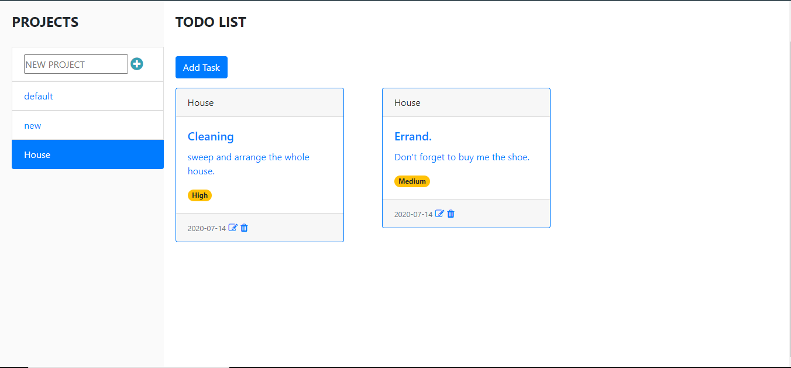

# TODO-LIST
A TO-DO list app built with javaScript.

## Built With

- HTML,
- CSS,
- JavaScript
- Bootstrap.
- Webpack.

### Prerequisites

- Node
- Npm

### Setup

- git clone `https://github.com/evansinho/TODO-LIST`
- cd TODO-LIST
- run npm install
- run npm run build
- Open the dist/index.html file in any web browser of your choosing.

## Live 

[live demo](https://raw.githack.com/evansinho/TODO-LIST/todo/dist/index.html)

## snaphot

### Usage

- Visit the live demo link on your web browser.

## Authors

👤 **Evanson Igiri**

- [Portfolio](https://evansinho.github.io/Evanson-igiri/)
- [Twitter](https://twitter.com/iamsinho1304)
- [Linkedin](LinkedIn.com/in/evanson-igiri)
- [Email](mailto:igiri.evanson@gmail.com)

👤 **Karthick Venkatesan**

- [Portfolio](https://karthi07.github.io/)
- [LinkedIn](https://www.linkedin.com/in/karthickvenkadesan/)
- [GitHub](https://github.com/karthi07)
- [E-mail](itkarthi02@gmail.com)

## 🤝 Contributing

Contributions, issues and feature requests are welcome!

Feel free to check the [issues page](https://github.com/evansinho/TODO-LIST/issues).

## Show your support

Give a ⭐️ if you like this project!

